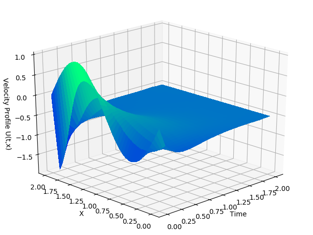
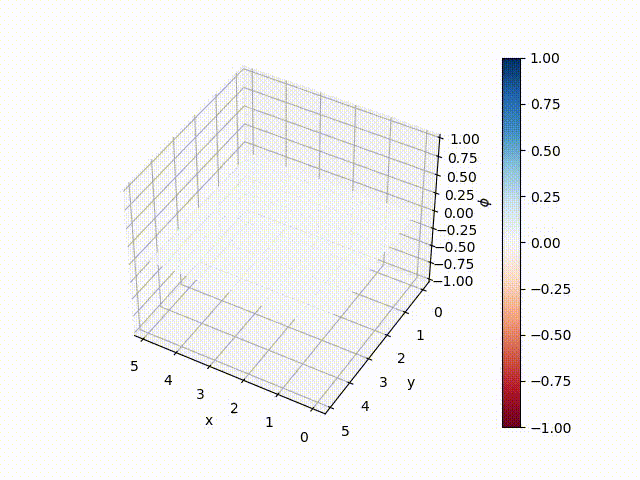
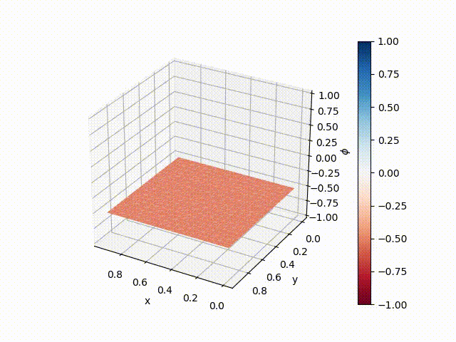
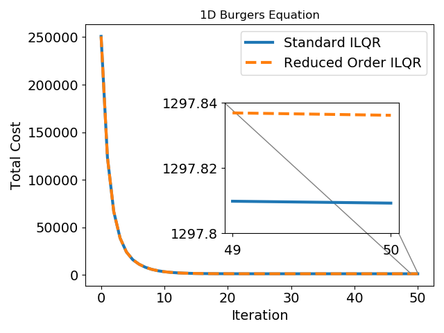
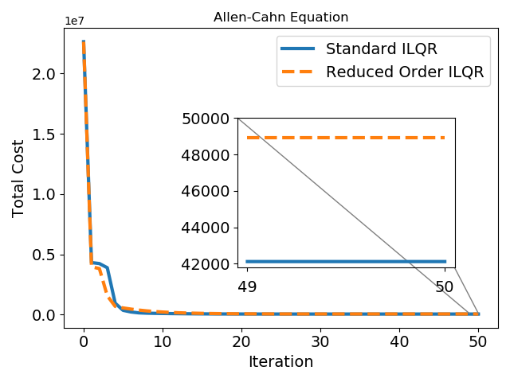
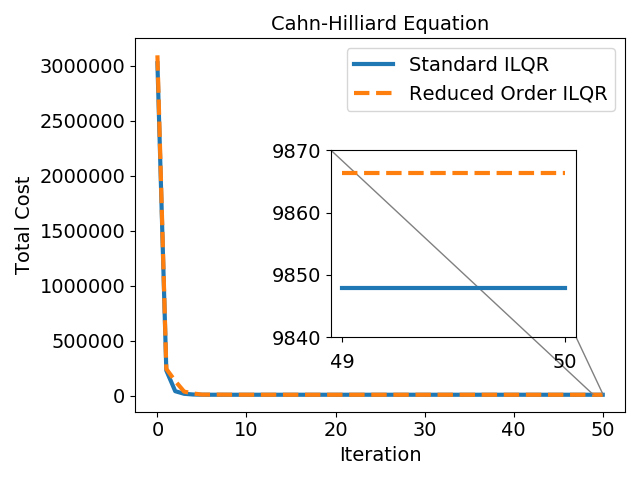

# Reduced‑Order Model–Based Reinforcement Learning for Optimal Control of Nonlinear PDEs 📐🧠

[](https://www.python.org/)

This repo contains the official implementation of  

**“A Reduced‑Order Iterative Linear Quadratic Regulator (iLQR) Technique for the Optimal Control of Nonlinear Partial Differential Equations.”**  
([[arXiv 2501.06635](https://arxiv.org/pdf/2501.06635)])

We propose **RO‑ILQR**, an algorithm that couples Proper Orthogonal Decomposition (POD) with online Linear‑Time‑Varying identification and model‑based RL (data-driven ILQR) to control high‑dimensional nonlinear PDEs sample‑efficiently.

---

## ✨ Key Highlights
| Feature | Details |
|---------|---------|
| 🛠 **Hybrid pipeline** | Snapshot-POD based dimensionality reduction → LTV ID → model‑based RL (iLQR) |
| 🚀 **45× faster** training vs. vanilla ILQR on PDE benchmarks |
| 🔧 **Plug‑and‑play**: works with Burgers, Allen‑Cahn, Cahn‑Hilliard, and custom PDEs |
| 📊 **Reproducible**: deterministic seeds|

---

## 📚 Paper
> A. Sharma & S. Chakravorty,  
> **“A Reduced‑Order Iterative Linear Quadratic Regulator (ILQR) Technique for the Optimal Control of Nonlinear Partial Differential Equations.”**  
> 2023 American Control Conference (ACC), San Diego, CA, USA, 2023, pp. 3389-3394, doi: 10.23919/ACC55779.2023.10156062.

## 📝 Citation
If you use this code, please cite:
```bibtex
@article{sharma2025reducedorderilqr,
  author  = {Aayushman Sharma and Suman Chakravorty},
  title   = {A Reduced-Order Iterative Linear Quadratic Regulator (iLQR) Technique for the Optimal Control of Nonlinear Partial Differential Equations},
  journal = {arXiv preprint},
  year    = {2025},
  eprint  = {2501.06635},
  url     = {https://arxiv.org/abs/2501.06635}
}
```

## 📊 Benchmark Outputs
<p align="center">
  
  <br/><em>1D Viscous Burgers PDE Optimal Trajectory.</em>
</p>

<p align="center">
  
  <br/><em>Allen-Cahn Microstructure Optimal Trajectory.</em>
</p>

<p align="center">
  
  <br/><em>Cahn-Hilliard Microstructure Optimal Trajectory.</em>
</p>

<p align="center">
  
  <br/><em>Benchmarking RO-ILQR with Standard ILQR for Burgers PDE.</em>
</p>

<p align="center">
  
  <br/><em>Benchmarking RO-ILQR with Standard ILQR for Allen-Cahn PDE.</em>
</p>

<p align="center">
  
  <br/><em>Benchmarking RO-ILQR with Standard ILQR for Cahn-Hilliard PDE.</em>
</p>


---

## 🛠️ Installation
```bash
git clone https://github.com/AayushmanSharma96/RO-MBRL.git
cd RO-MBRL
Scripts: burgers_model_free_ddp.py, material_model_free_ddp.py


